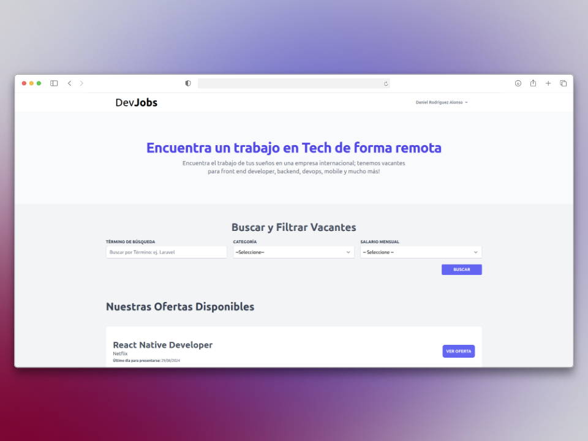
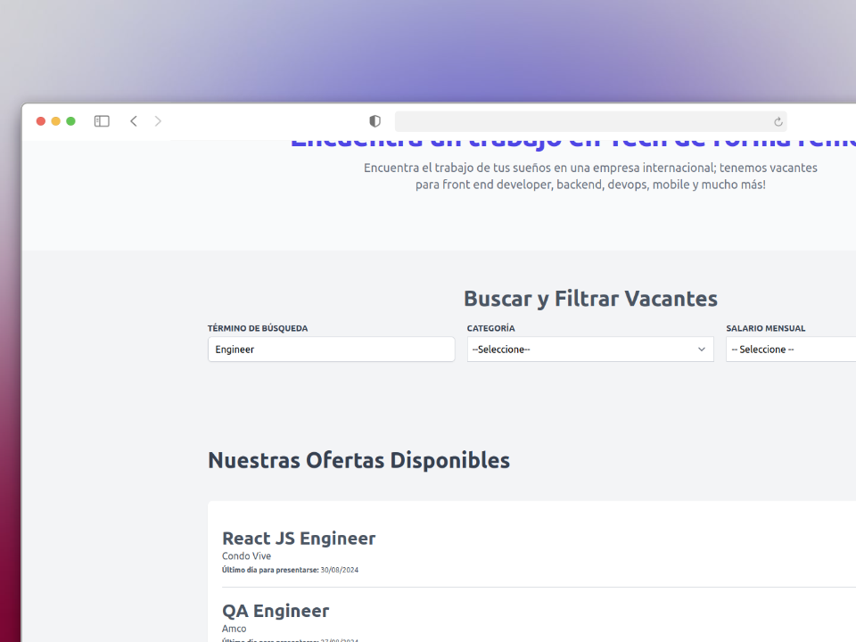
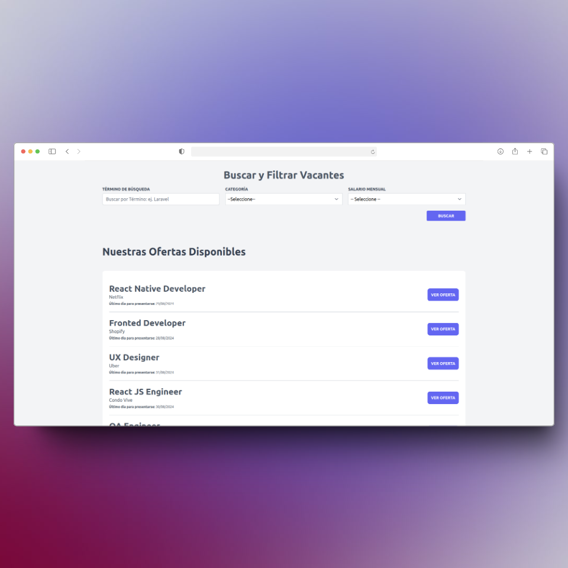
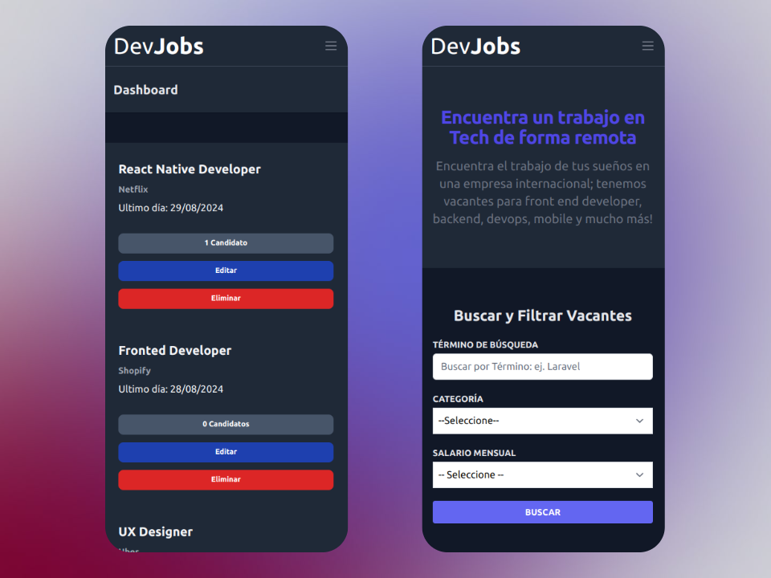
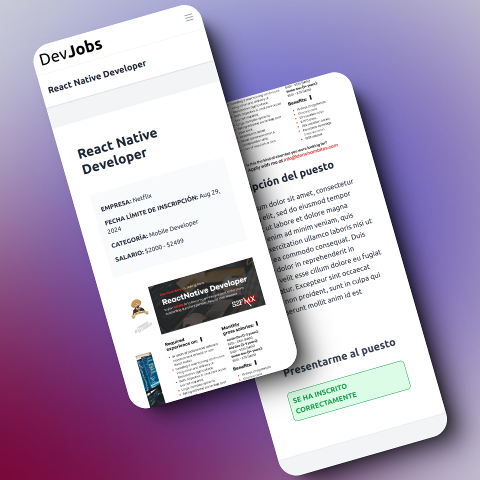

<p align="center"><a href="https://laravel.com" target="_blank"></a></p>


# DevJob en Laravel

DevJobs es una aplicación web desarrollada con Laravel y Livewire con la que los usuarios pueden registrase como desarrollador o como reclutador y buscar o crear ofertas de trabajos para diferentes perfiles tecnologicos.

## Requisitos

- <a href="https://www.docker.com/" target="_blank">Docker</a>
- <a href="https://docs.docker.com/compose/" target="_blank">Docker Compose</a>

## Instalación

1. Clona el repositorio en tu máquina local:
    ```{bash}
   git clone https://github.com/danirodriguezz/DevJobs.git
    ```
2. Navega hasta el directorio del proyecto
   
    ```{bash}
    cd DevJobs
    ```
3. Copia el archivo de configuración de ejemplo y configuralo segun tus preferencias

    ```{bash}
   cp .env.example .env
    ```
4. Ejecuta el entorno de desarrollo con Docker Compose
   
    ```{bash}
   ./vendor/bin/sail up -d
    ```
5. Genera una clave de aplicación
   
    ```{bash}
    ./vendor/bin/sail artisan key:generate
    ```
6. Ejecuta las migraciones de la base de datos:

    ```{bash}
    ./vendor/bin/sail artisan migrate
    ```

7. Visita http://localhost en tu navegador para ver la aplicación DevJobs.

## Uso

1. Registrate en la aplicación creando un nuevo usuario como reclutador
2. Confirma el usuario abriendo el email en el navegador en la direccion http://localhost:8025/
3. Confirma el usuario que has creado
4. Crea una oferta de trabajo
5. Crea un desarrollador y registrate en la oferta de trabajo

## Mockups de Ordenador









## Mockups de Movil





